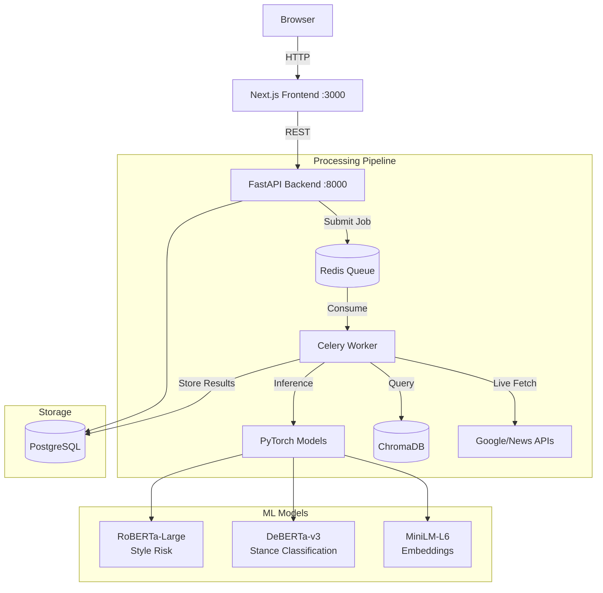

# PRISM: Explainable AI for Misinformation Detection

<div align="center">

**A hybrid intelligence platform that pairs stylometric forensics with agentic, retrieval-augmented fact-checking to deliver evidence-backed, analyst-ready reports instead of opaque labels.**

[](LICENSE)
[](https://python.org)
[](https://nextjs.org)
[](https://docker.com)

</div>

---

## Table of Contents
- [What PRISM Does](#what-prism-does)
- [Key Features](#key-features)
- [Architecture](#architecture)
- [UI/UX Philosophy](#uiux-philosophy)
- [Quick Start](#quick-start)
- [Environment Variables](#environment-variables)
- [Project Structure](#project-structure)
- [API Reference](#api-reference)
- [Development Guide](#development-guide)
- [Scope for Improvement](#scope-for-improvement)
- [Contributing](#contributing)
- [License](#license)

---

## What PRISM Does

PRISM is a **research-grade misinformation analysis tool** designed for journalists, fact-checkers, and analysts. Unlike black-box classifiers that emit a single "fake/real" label, PRISM provides:

1. **Linguistic Forensics**: Analyzes *how* a claim is written, detecting manipulation patterns like emotional loading, conspiracy framing, and causal absolutes.

2. **Evidence-Grounded Verification**: Retrieves and cross-references sources from a curated fact-check corpus (NASA, WHO, FactCheck.org, PolitiFact) using semantic similarity and NLI.

3. **Agentic Enrichment**: When internal evidence is insufficient, background workers perform live web searches, ingest reputable sources, and rerun verification automatically.

4. **Analyst-Grade Reporting**: Clean 2-column dashboard with per-claim risk breakdown, source citations, and PDF-ready briefings.

---

## Key Features

### Core Analysis Pipeline
| Feature | Description |
|---------|-------------|
| **Stylometric Risk Scoring** | Fine-tuned RoBERTa-Large detects manipulation patterns (0-100 risk score) |
| **NLI-Based Verification** | Transformer-based Natural Language Inference classifies evidence as supporting/refuting/neutral |
| **Semantic Retrieval** | SentenceTransformer embeddings query ChromaDB with relevance gating |
| **Agentic Web Fetch** | Celery workers trigger live Google Fact Check/news queries when evidence is thin |
| **Safety-First Defaults** | Returns "Insufficient Evidence" rather than speculating |

### UI/UX Highlights
| Feature | Description |
|---------|-------------|
| **2-Column Analysis Canvas** | Linguistic analysis (left) + Evidence verification (right) for side-by-side comparison |
| **Horizontal Summarization** | Verdict, Signals, and Why in compact one-line format |
| **Collapsible Details** | Signal details and extra sources tucked behind expandable sections |
| **Interpretation Sentence** | Full-width synthesis helping non-technical users understand the verdict |
| **Signal-Aware Legend** | Highlights only detected linguistic patterns; greys out unused ones |
| **Compact Header Bar** | Sticky navigation with "New Analysis" button after submission |

### Safety & Reliability
- **Relevance Gating**: Cosine thresholds reject evidence below 80% relevance
- **Semantic Safety Check**: NLI-based detection of health/safety claims
- **Rate Limiting**: Redis-backed sliding-window limits on API
- **Domain Reputation**: Credible sources boosted, low-quality flagged
- **Conservative Fallbacks**: "Insufficient Evidence" over speculation

---

## Architecture



### Tech Stack
| Layer | Technology |
|-------|------------|
| **Frontend** | Next.js 14, TailwindCSS, Lucide Icons |
| **API** | FastAPI, Uvicorn, SlowAPI (rate limiting) |
| **Queue** | Celery + Redis |
| **ML** | PyTorch, HuggingFace Transformers, SentenceTransformers |
| **Vector DB** | ChromaDB |
| **Database** | PostgreSQL 15 |
| **Orchestration** | Docker Compose |

---

## UI/UX Philosophy

PRISM's interface is designed to feel like an **investigation report**, not a dashboard of widgets.

### Design Principles

1. **Two-Column Canvas**
   - Left: *How the claim is written* (Linguistic Analysis)
   - Right: *What the world says* (Verification Context)
   - Enables comparison without scrolling

2. **Internal Consistency**
   - Verdict, Why, Banner, Legend, and Interpretation all tell the same story
   - No contradictions between components

3. **Progressive Disclosure**
   - Show insight by default, hide implementation details
   - Signal Details and extra sources are collapsible

4. **Whitespace with Purpose**
   - 32px section spacing, 16px subsections
   - Space = pause, Divider = transition

5. **Proportional Highlighting**
   - Underlines instead of alarming red blocks
   - Only detected signals shown in legend

---

## Quick Start

### Prerequisites
- **Docker Desktop** installed and running
- **8GB+ RAM** recommended (ML models are loaded in-memory)
- (Optional) Google Fact Check Tools API key

### Installation

```bash
# 1. Clone the repository
git clone https://github.com/your-org/prism.git
cd prism

# 2. Configure environment
cp .env.example .env
# Edit .env with your API keys (optional)

# 3. Launch the full stack
docker-compose up --build

# 4. Wait for all services to become healthy (~2-3 minutes first run)
```

### Access Points
| Service | URL |
|---------|-----|
| **Web UI** | http://localhost:3000 |
| **API Docs** | http://localhost:8000/docs |
| **Health Check** | http://localhost:8000/health |

### First Analysis
1. Open http://localhost:3000
2. Paste a claim (e.g., "Drinking bleach cures COVID")
3. Click "Analyze"
4. Wait ~10-30 seconds for the full pipeline
5. Review the 2-column analysis canvas

---

## Environment Variables

Create a `.env` file in the project root:

```bash
# Required
POSTGRES_USER=prism
POSTGRES_PASSWORD=your_secure_password
POSTGRES_DB=prism

# Optional: External APIs
GOOGLE_FACT_CHECK_API_KEY=your_key_here  # Enables live fact-check queries
NEWS_API_KEY=your_key_here               # Enables news article enrichment

# Optional: Performance Tuning
CELERY_CONCURRENCY=2                     # Worker threads (default: 2)
CHROMA_PERSIST_DIR=/data/chromadb        # Vector store persistence

# Optional: Rate Limiting
RATE_LIMIT=10/minute                     # API rate limit per IP
```

---

## Project Structure

```
prism/
├── app/                          # Next.js 14 Frontend
│   ├── app/
│   │   ├── components/           # React components
│   │   │   ├── analysis-form.tsx
│   │   │   ├── linguistic-analysis.tsx
│   │   │   ├── evidence-stack.tsx
│   │   │   ├── risk-summary.tsx
│   │   │   └── heatmap-text.tsx
│   │   ├── api/                  # Next.js API routes (proxy)
│   │   ├── report/[jobId]/       # PDF-ready report page
│   │   └── page.tsx              # Main analysis canvas
│   ├── Dockerfile
│   └── package.json
│
├── ml/                           # Python ML Monorepo
│   ├── main.py                   # FastAPI application
│   ├── models.py                 # SQLAlchemy models
│   ├── core/
│   │   ├── stylometry.py         # RoBERTa style risk detection
│   │   ├── nli.py                # Stance classification (NLI)
│   │   ├── rag.py                # Retrieval-augmented generation
│   │   └── xai.py                # Explainability (gradient saliency)
│   ├── workers/
│   │   ├── celery_app.py         # Celery configuration
│   │   └── tasks.py              # Analysis pipeline tasks
│   ├── training/
│   │   ├── train.py              # Model fine-tuning
│   │   └── calibrate.py          # Risk score calibration
│   ├── Dockerfile
│   └── requirements.txt
│
├── scripts/                      # Utility scripts
│   ├── verify_*.py               # Verification test scripts
│   └── seed_chromadb.py          # Vector DB seeding
│
├── docker-compose.yml            # Full stack orchestration
├── .env.example                  # Environment template
└── README.md                     # This file
```

---

## API Reference

### POST `/api/analyze`
Submit a claim for analysis.

```bash
curl -X POST http://localhost:8000/api/analyze \
  -H "Content-Type: application/json" \
  -d '{"text": "Russia attacked Ukraine"}'
```

**Response:**
```json
{
  "job_id": "abc123",
  "status": "pending"
}
```

### GET `/api/status/{job_id}`
Poll for analysis results.

**Response (completed):**
```json
{
  "status": "completed",
  "result": {
    "style_risk_score": 45,
    "linguistic_verdict": "Some patterns warrant verification.",
    "linguistic_signals": [...],
    "evidence": [...],
    "stance_summary": {"supports": 3, "refutes": 1, "neutral": 2},
    "heatmap": [...]
  }
}
```

### GET `/health`
Service health check.

---

## Development Guide

### Local Development (Without Docker)

#### Backend (FastAPI + Celery)
```bash
cd ml
python -m venv venv
source venv/bin/activate  # or venv\Scripts\activate on Windows
pip install -r requirements.txt

# Start Redis (required)
docker run -d -p 6379:6379 redis:7

# Start API
uvicorn main:app --reload --port 8000

# Start Worker (separate terminal)
celery -A workers.celery_app worker --loglevel=info
```

#### Frontend (Next.js)
```bash
cd app
npm install
npm run dev
```

### Running Tests
```bash
# ML Tests
cd ml
python -m pytest tests/

# Verification Scripts
python scripts/verify_mixed_medium.py
python scripts/verify_unverified_danger.py
```

### Code Style
- **Python**: Black + isort
- **TypeScript**: ESLint + Prettier
- **Commits**: Conventional Commits (`feat:`, `fix:`, `docs:`)

---

## Scope for Improvement

PRISM is an active research project. Here are areas ripe for contribution:

### High Priority 🔥

| Area | Description | Difficulty |
|------|-------------|------------|
| **Multilingual Support** | Extend stylometry and NLI to non-English claims | Hard |
| **Fine-tuned NLI Model** | Train domain-specific stance classifier on misinformation datasets | Medium |
| **Real-time Streaming** | WebSocket-based progress updates during analysis | Medium |
| **Browser Extension** | Chrome/Firefox extension for inline fact-checking | Hard |

### Medium Priority 🌟

| Area | Description | Difficulty |
|------|-------------|------------|
| **Citation Graph** | Visualize source relationships with D3.js | Medium |
| **Batch Analysis** | Upload CSV/JSON of claims for bulk processing | Easy |
| **Custom Corpus Ingestion** | Admin UI to add trusted sources to ChromaDB | Medium |
| **Claim Extraction** | Auto-extract checkable claims from long articles | Medium |
| **Historical Tracking** | Timeline view of how a claim evolved over time | Hard |

### Low Priority / Nice-to-Have 💡

| Area | Description | Difficulty |
|------|-------------|------------|
| **Dark Mode** | Theme toggle (current: light only) | Easy |
| **Mobile App** | React Native wrapper | Hard |
| **API SDK** | Python/JS client libraries | Easy |
| **Prometheus Metrics** | Observability integration | Medium |
| **A/B Testing Framework** | Compare different model versions | Medium |

### Research Directions 🔬

- **Multimodal Analysis**: Extend to images/videos (deepfake detection)
- **Temporal Reasoning**: Detect outdated claims that were once true
- **Adversarial Robustness**: Harden against manipulation-resistant text
- **Provenance Tracking**: Blockchain-based source verification

---

## Contributing

We welcome contributions! Here's how to get started:

### 1. Fork & Clone
```bash
git clone https://github.com/YOUR_USERNAME/prism.git
cd prism
git remote add upstream https://github.com/original/prism.git
```

### 2. Create a Branch
```bash
git checkout -b feature/your-feature-name
```

### 3. Make Changes
- Follow the code style guidelines
- Add tests for new functionality
- Update documentation as needed

### 4. Test Your Changes
```bash
# Ensure Docker stack works
docker-compose up --build

# Run tests
cd ml && python -m pytest
```

### 5. Submit a Pull Request
- Clear description of what and why
- Reference any related issues
- Include screenshots for UI changes

### Code of Conduct
Be respectful, constructive, and inclusive. No tolerance for harassment.

---

## Acknowledgements

- **HuggingFace** for transformer models
- **ChromaDB** for vector storage
- **Celery** for distributed task processing
- **Next.js** for the frontend framework
- **Fact-checking organizations** (PolitiFact, FactCheck.org, WHO, NASA) for trusted data

---

## License

MIT License - Open for research, educational, and commercial use.

```
Copyright (c) 2024 PRISM Contributors

Permission is hereby granted, free of charge, to any person obtaining a copy
of this software and associated documentation files (the "Software"), to deal
in the Software without restriction, including without limitation the rights
to use, copy, modify, merge, publish, distribute, sublicense, and/or sell
copies of the Software, and to permit persons to whom the Software is
furnished to do so, subject to the following conditions:

The above copyright notice and this permission notice shall be included in all
copies or substantial portions of the Software.
```

---

<div align="center">

**Built with ❤️ for the fight against misinformation**

[Report Bug](https://github.com/your-org/prism/issues) · [Request Feature](https://github.com/your-org/prism/issues) · [Discussions](https://github.com/your-org/prism/discussions)

</div>
