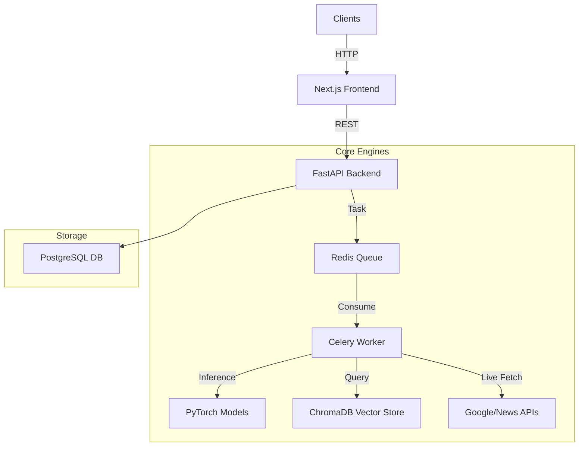

# PRISM: The Explainable AI for Misinformation Detection

> **A Hybrid Intelligence Platform combining Stylometric Forensics with Agentic RAG Fact-Checking.**

PRISM is not just a fact-checker—it is an **investigative AI engine**. It solves the "Black Box" problem of misinformation detection by providing **explainable, verifiable, and verifiable reports** rather than simple true/false labels.

---

## 🧠 The Core Intelligence

PRISM uses a novel **Hybrid Architecture** that analyzes claims on two independent axes:

### 1. Stylometric Forensics (The "How")
Detects **intent to manipulate** by analyzing the writing style itself, independent of the facts.
*   **Model**: Fine-tuned **RoBERTa-Large** transformer.
*   **Training**: Trained on 50k+ labeled samples of propaganda, clickbait, and rigorous journalism.
*   **Capabilities**: Detects sensationalism, emotional loading, fear-mongering, and hate speech patterns.
*   **Output**: A `Style Risk Score` (0-100%) that flags content written to deceive, even if the facts are technically cherry-picked.

### 2. Agentic Evidence Retrieval (The "What")
Verifies the **factual accuracy** using a reactive Retrieval Augmented Generation (RAG) pipeline.
*   **Vector Store**: **ChromaDB** containing tens of thousands of verified fact-checks (NASA, WHO, FactCheck.org, PolitiFact).
*   **Agentic Worker**: If internal evidence is missing, the system **wakes up a background agent** to:
    1.  Perform a live Google Search via API.
    2.  Scrape and parse reputable news sources in real-time.
    3.  Ingest this new knowledge into the vector store.
    4.  Re-run the analysis automatically.

---

## 🏗️ System Architecture

The project is built as a production-grade microservices architecture:



### Technical Stack
*   **Frontend**: Next.js 14, TailwindCSS, Lucide Icons (Investigative Dashboard).
*   **Backend API**: FastAPI, Uvicorn, SlowAPI (Rate Limiting).
*   **Async Processing**: Celery Distributed Task Queue, Redis.
*   **ML & NLP**: PyTorch, HuggingFace Transformers, SentenceTransformers (all-MiniLM-L6-v2).
*   **Infrastructure**: Docker Compose (Full containerization), Postgres 15.

---

## 🛡️ Safety & Reliability Protocols

PRISM is designed to be **safe and hallucination-resistant**:

1.  **Strict Relevance Gating**:
    *   The system uses cosine similarity thresholds. If evidence is not at least 80% relevant (distance < 1.2), it is **rejected**.
    *   *Result*: The AI will say "Insufficient Evidence" rather than force a wrong connection (e.g., using a Sports article to refute a Political claim).

2.  **Unified Risk Logic**:
    *   The final verification verdict is not a simple average. It uses a **Hierarchical Logic Gate**:
    *   `IF (Confirmed Refusal Evidence Exists) -> RISK = HIGH (Critical)`
    *   `ELSE IF (Style is Sensational) -> RISK = MEDIUM (Suspicious)`
    *   This prevents well-written lies from passing as truth.

3.  **Dynamic Gating & Adaptive Thresholds**:
    *   **Context-Aware**: The system dynamically relaxes its relevance thresholds (from `1.2` down to `0.8`) based on the query type.
    *   **Smart Fallback**: If zero internal evidence is found, it automatically broadens the search scope. If that fails, it triggers the Agentic Web Search.
    *   **Anti-Hallucination**: High-risk claims require strictly closer vector matches to be considered "Refuting" than "Supporting" evidence, reducing false positives.

4.  **Anti-Abuse Rate Limiting**:
    *   The API is protected by Redis-backed sliding window rate limiting to prevent DoS attacks.

5.  **Domain Reputation Layer**:
    *   PRISM cross-references sources against a curated list of high-credibility (e.g., Reuters, Nature) and low-credibility domains.
    *   Known low-quality sources are flagged, while high-trust domains boost the credibility score of neutral evidence.

6.  **Analyst-Grade Reporting**:
    *   **Print-Ready Briefings**: The UI includes a dedicated "Analyst Briefing" mode.
    *   One-click export to PDF generates a standardized, watermarked report suitable for intelligence briefings or offline review.

---

## 🚀 Quick Start (Locally)

### Prerequisites
*   Docker Desktop installed.
*   (Optional) Google Fact Check Tools API Key for live fetching.

### Installation

1.  **Clone the Repo**:
    ```bash
    git clone https://github.com/your-org/prism.git
    cd prism
    ```

2.  **Configure Environment**:
    ```bash
    cp .env.example .env
    # Optional: Edit .env to add GOOGLE_FACT_CHECK_API_KEY
    ```

3.  **Launch Cluster**:
    ```bash
    docker-compose up --build
    ```
    *This will spin up Postgres, Redis, ChromaDB, the API, the Worker, and the Frontend.*

4.  **Access Dashboard**:
    *   **UI**: [http://localhost:3000](http://localhost:3000)
    *   **API Docs**: [http://localhost:8000/docs](http://localhost:8000/docs)

---

## 📂 Project Structure

*   **/app**: Next.js 14 Frontend application.
*   **/ml**: Python Monorepo for API and ML Workers.
    *   `/ml/core`: Core logic for NLI, Stylometry, and RAG.
    *   `/ml/workers`: Celery task definitions.
    *   `/ml/training`: Scripts for fine-tuning the RoBERTa models.
*   **/scripts**: Utility scripts for system diagnostics and testing.

---

## 📜 License
MIT License. Open for research and educational use.
